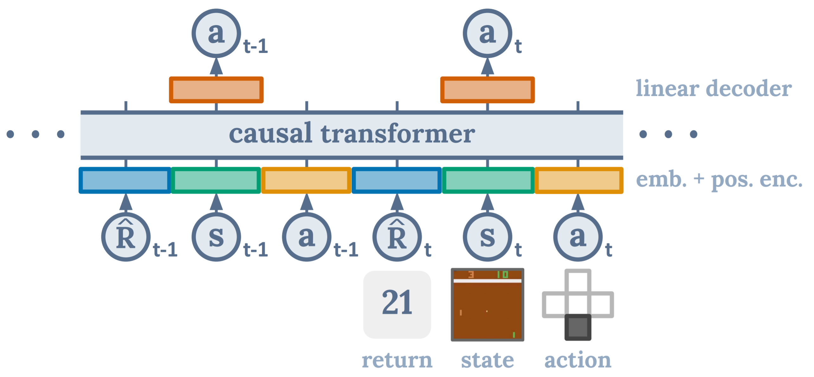

# Decision Transformer

Lili Chen\*, Kevin Lu\*, Aravind Rajeswaran, Kimin Lee, Aditya Grover, Michael Laskin, Pieter Abbeel, Aravind Srinivas†, and Igor Mordatch†

\*equal contribution, †equal advising

A link to our paper can be found on [arXiv](https://arxiv.org/abs/2106.01345).

## Overview

Official codebase for [Decision Transformer: Reinforcement Learning via Sequence Modeling](https://sites.google.com/berkeley.edu/decision-transformer).
Contains scripts to reproduce experiments.



## Instructions

We provide code in two sub-directories: `atari` containing code for Atari experiments and `gym` containing code for OpenAI Gym experiments.
See corresponding READMEs in each folder for instructions; scripts should be run from the respective directories.
It may be necessary to add the respective directories to your PYTHONPATH.

## Citation

Please cite our paper as:

```
@article{chen2021decisiontransformer,
  title={Decision Transformer: Reinforcement Learning via Sequence Modeling},
  author={Lili Chen and Kevin Lu and Aravind Rajeswaran and Kimin Lee and Aditya Grover and Michael Laskin and Pieter Abbeel and Aravind Srinivas and Igor Mordatch},
  journal={arXiv preprint arXiv:2106.01345},
  year={2021}
}
```

Note: this is not an official Google or Facebook product.

## License

MIT
